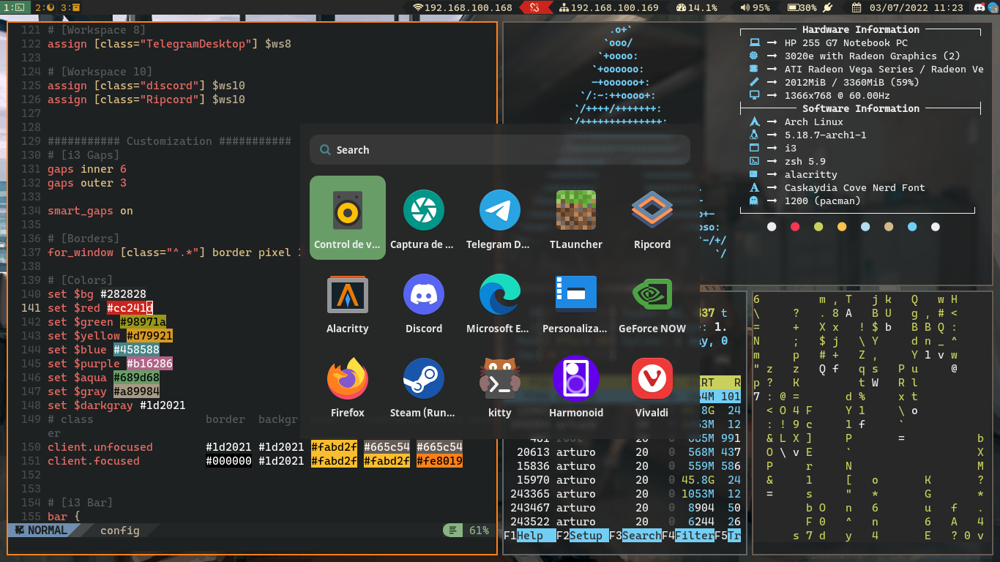
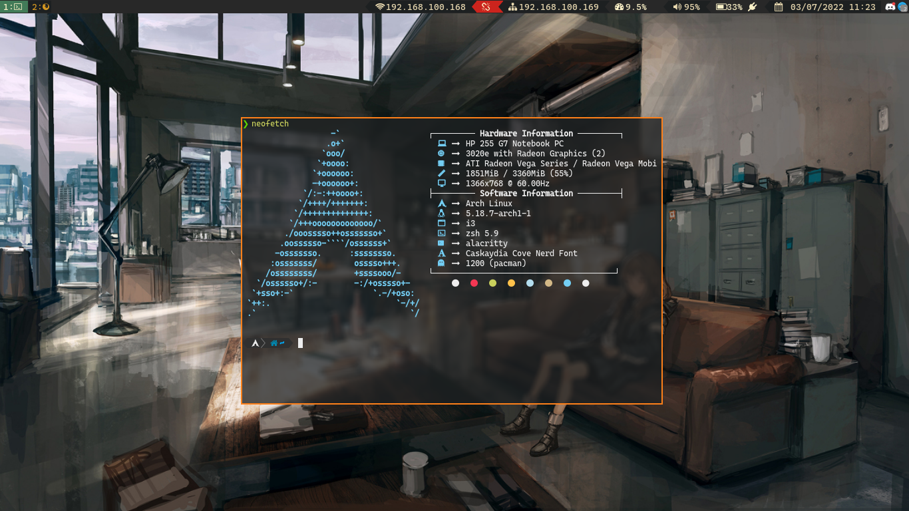

# NinjagoRT's Configuration Files (Dotfiles)

This is my basic i3 configuration file:

## Packages 

* **i3wm**: Window manager
* **Picom** (yshui fork) Compositor for x11
* **bumblebee-status**: i3bar theme and configuration
* **Kitty**: My favorite Terminal emulator
* **Nerdfonts**
* **Rofi**: A hackeable launcher for my apps
* **Neofetch**: yes!
* **ZSH** My default shell

## Images:

